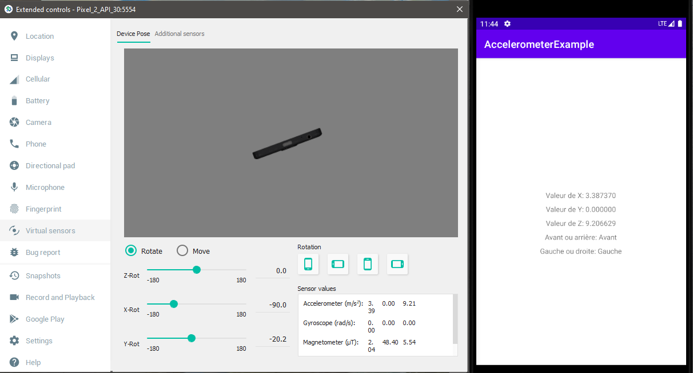
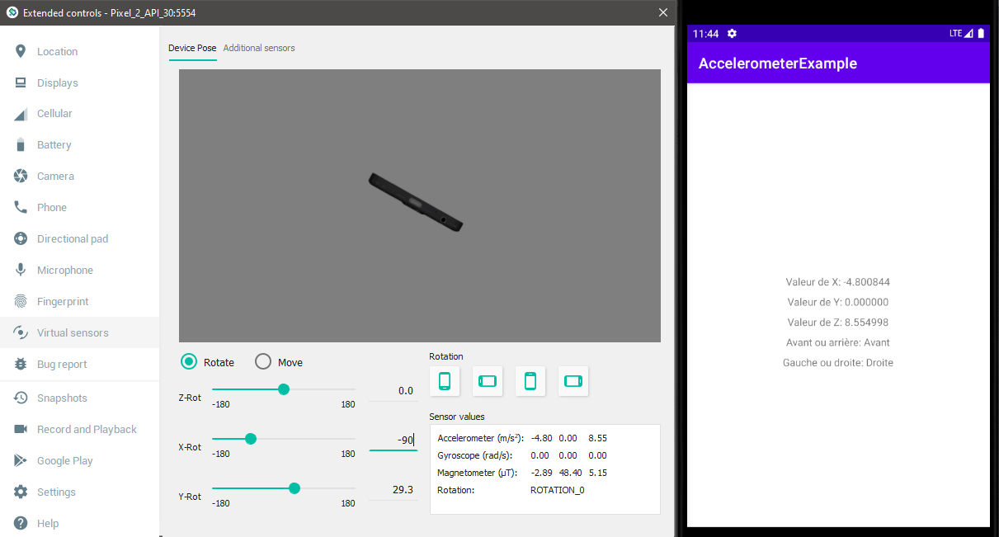
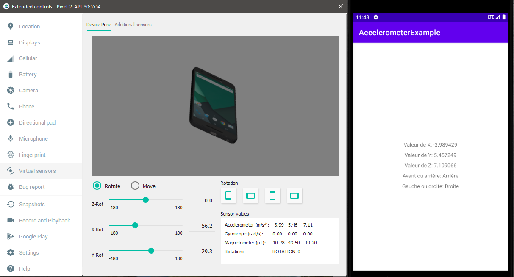
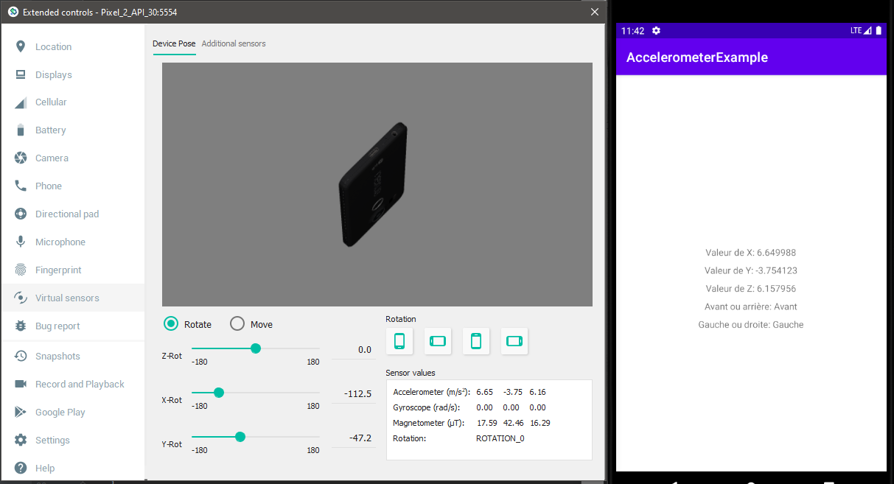

# AccelerometerExample

Projet exemple pour montrer comment écouter/ajouter/supprimer des éléments dans une base de données Firebase Realtime Database.

Tuto de mise en place:

Tourné vers la gauche:

Tourné vers la droite:

Tourné vers l'arrière droite:

Tourné vers l'arrière gauche:

